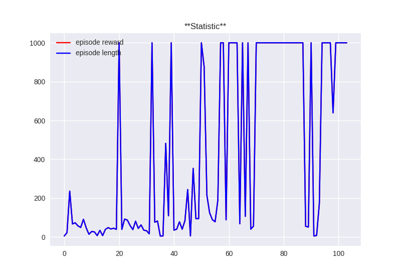
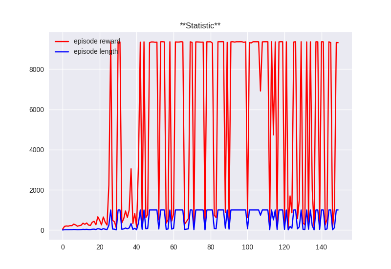

# Continuous A3C

<p></p>

This code aims to solve some control problems, espicially in Mujoco, and is highly based on [pytorch-a3c](https://github.com/ikostrikov/pytorch-a3c). What's difference between this repo and pytorch-a3c:

- compatible to Mujoco envionments
- the policy network output the mu, and sigma 
- construct a gaussian distribution from mu and sigma
- sample the data from the gaussian distribution
- modify entropy

Note that this repo is only compatible with Mujoco in OpenAI gym. If you want to train agent in Atari domain, please refer to [pytorch-a3c](https://github.com/ikostrikov/pytorch-a3c).

## Requirements
- gym
- mujoco-py
- pytorch
- matplotlib (optional)
- seaborn (optional)

## Usage

There're three tasks/modes for you: train, eval, develop.

- train:
```
python main.py --env-name InvertedPendulum-v1 --num-processes 16 --task train
```
- eval:
```
python main.py --env-name InvertedPendulum-v1 --task eval --display True --load_ckpt ckpt/a3c/InvertedPendulum-v1.a3c.100 
```

You can choose to display or not using ```display flags```

- develop:
```
python main.py --env-name InvertedPendulum-v1 --num-processes 16 --task develop
```

In some case that you want to check if you code runs as you want, you might resort to ```pdb```. Here, I provide a develop mode, which only runs in one thread (easy to debug).


## Experiment results

### learning curve

The plot of total reward/episode length in 1000 steps:

- InvertedPendulum-v1



- InvertedDoublePendulum-v1



### video

- InvertedPendulum-v1

<a href="http://www.youtube.com/watch?feature=player_embedded&v=E7QlRIkKuXo
" target="_blank"></a>

- InvertedDoublePendulum-v1

<a href="http://www.youtube.com/watch?feature=player_embedded&v=WNiitHoz8x4
" target="_blank"></a>

## TODO
I implement the ShareRMSProp in ```my_optim.py```, but I haven't tried it yet.

## Reference
- [pytorch-a3c](https://github.com/ikostrikov/pytorch-a3c)
